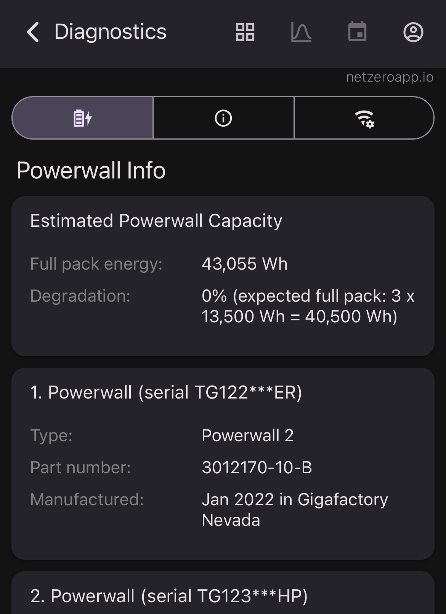

# Netzero - Powerwall Capacity Estimate

## Introduction

[Netzero](https://www.netzero.energy) tracks Powerwall capacity and degradation over time. Connecting directly to your Tesla Gateway or Powerwall 3 with the Netzero app provides diagnostic information, including battery capacity. However, Gateway access requires your home network and password ([see details](https://docs.netzero.energy/docs/diagnostics/Powerwall2)), and Tesla made Powerwall 3 diagnostics more difficult ([see details](https://docs.netzero.energy/docs/diagnostics/Powerwall3)). To address these limitations, Netzero also estimates battery capacity and degradation.



## Estimating Capacity

Powerwall capacity estimates cover all connected batteries combined, not individual units. For example, two Powerwalls may show 27 kWh (13.5 kWh each). To view individual capacities, connect directly to your Tesla Gateway.

Capacity estimation analyzes historical Powerwall charge and discharge cycles. Netzero identifies days with significant cycles (e.g., 30% to 100%) and divides total charged energy by the change in state of charge. For example, if the Powerwall charges from 9 AM to 2 PM, increasing from 30% to 100% with 9,800 Wh charged, the full capacity is:

```
9,800 Wh / (100% - 30%) = 14,000 Wh
```

This calculation repeats across many days to provide a statistically significant result. Through experimentation, we identified the most representative days for accurate capacity estimation.

## Accuracy

We evaluated the methodology by comparing estimated and diagnostic capacity values (ground truth) across more than one thousand Powerwalls. The average error was under 2%, confirming the estimates' reliability.

## Troubleshooting

If your estimated capacity is missing, possible causes include:

- **Backup reserve set to 100%**: Powerwalls cannot charge or discharge, so capacity estimation is impossible.
- **Recent installation**: Newly installed Powerwalls may lack sufficient data. Check again after a week of consistent charging.
- **Change in the number of Powerwalls**: After adding or removing a Powerwall, capacity estimation needs time to recalibrate.
