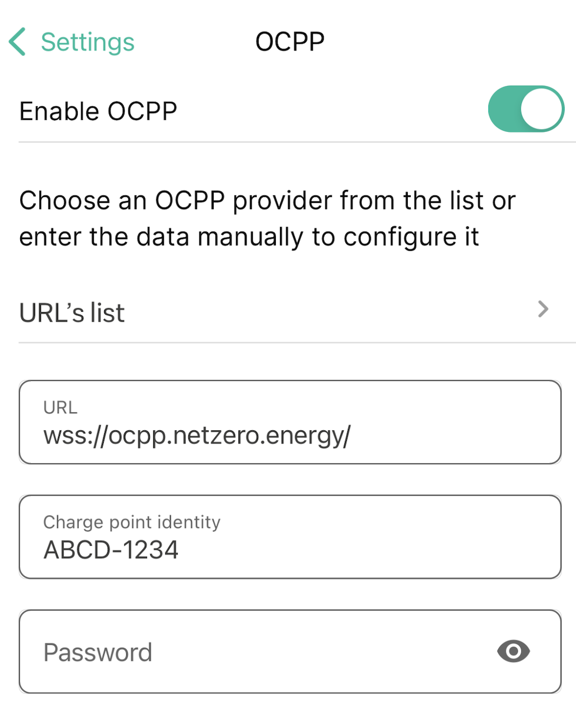
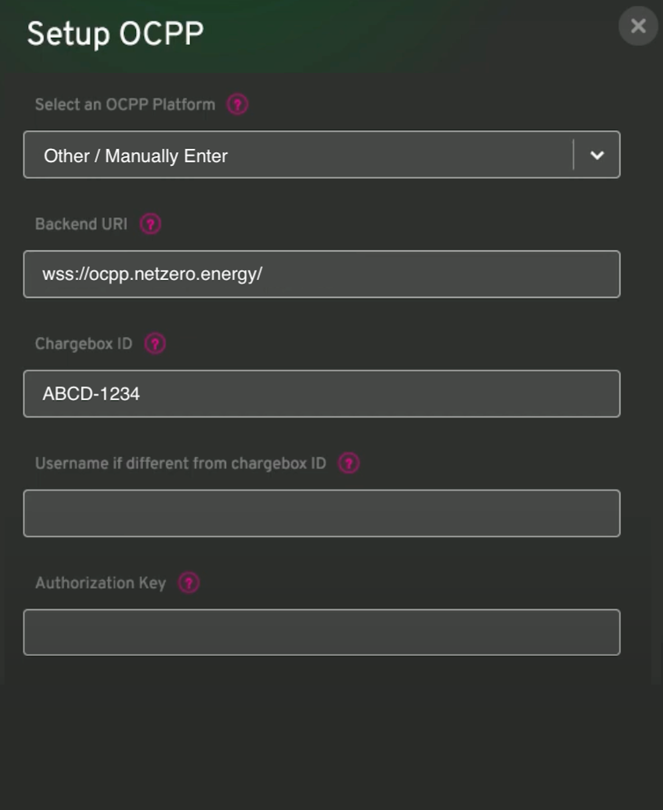

# Netzero - EV Charger Settings

## Introduction

[Netzero](https://www.netzero.energy) automations enable configuration changes for Powerwall systems based
on EV charging status. For example, you can configure your Powerwall to preserve charge when EV charging
starts and avoid discharging the Powerwall into the (much larger) EV battery. You can also automatically
start or stop EV charging, for example based on electricity pricing or Powerwall state of charge.

Depending on your EV charging setup, there are different ways for Netzero to determine charging status and
manage charging. There are integrations for **Tesla Wall Connectors**, **Tesla vehicles**, and
**OCPP-compatible EV chargers** (e.g. **Wallbox** or **myenergi zappi**).

To configure your EV charger, navigate to `Settings > Vehicle Charging`. Once the charger is configured,
you use the `EV Charging` tab on top of the `New Automation` screen to configure automations based
on the start or stop of EV charging.

## Tesla Wall Connector

If you have a Gen 3 Tesla Wall Connector (Wi-Fi enabled Wall Connector), that's a simple and
reliable way for Netzero to determine charging status and manage charging.

If necessary, add the Wall Connector to your energy system in the Tesla app by selecting the product
drop-down in the top left and selecting `Add Product`. Once the Wall Connector is successfully added
to your energy system, the Tesla app should show a car garage with the Wall Connector next to the
Powerwall.

No further setup is required in Netzero to access the Wall Connector data. You can confirm the status
on the `Settings > Vehicle Charging` screen.

### Notes

- If your Wall Connector is not added to your energy system, but listed as a separate product the
  in the Tesla app (when using the top-left dropdown), you will have to contact Tesla Support to
  combine the two systems into one.

## Tesla Vehicle

If you have a Tesla vehicle, you can configure access so Netzero can track its charging status and
manage charging. Note: Netzero will only access charging information. It will not access location or
any other vehicle data that's not related to charging. The only location-related data it receives is
whether the vehicle is at home, without the specifics of where home is (this is so automations
can only trigger for home charging). Netzero does not have access to unlock or start your vehicle,
or camera access. It will also not wake up your vehicle to get the charging status.

Charging status is tracked using [Tesla Fleet Telemetry](https://developer.tesla.com/docs/fleet-api/fleet-telemetry),
a secure way for Tesla vehicles to report specific data to third-party services such as Netzero. The
initial setup requires a few more steps:

1. If necessary, add permissions so Netzero can access vehicle data. Navigate to the `Settings > Vehicle Charging`
screen and follow the app instructions to enable the **Vehicle Information** and
**Vehicle Charging Management** permissions. Once permissions are added, return to the app and refresh
the state. If you had already added permissions when first logging in with Netzero, you will skip this step.

2. Set up a [Virtual Key](https://www.tesla.com/_ak/api.netzeroapp.io) for Netzero, a secure connection
to your vehicle. The key can be revoked if required. Netzero does not have permission to unlock or
start your vehicle. Note: if you are not the owner of the vehicle, you will to be in the vehicle with
a Tesla key card when completing this process. Older Tesla Model S and X vehicle do not support
Fleet Telemetry.

3. Once the key is set up, Fleet Telemetry will be automatically configured and the vehicle will
start reporting its charging status.


### Notes

- If you have a pre-2021 Tesla Model S or X, Fleet Telemetry is not supported. Netzero will use a
  different process for determining charging status and managing charging, so adding the Virtual
  Key is not needed.


## OCPP-compatible EV charger

Some EV chargers support OCPP (Open Charge Point Protocol), an application protocol for communication
between EV chargers and central management systems (providers).  If your EV charger is compatible,
you can configure Netzero as the provider. This integration will share the EV charger’s status and
allow remote control in the future.

Examples of compatible chargers include **Wallbox** and **myenergi zappi**. If your EV charger is compatible,
you will see an OCPP configuration option the EV charger's app. Configure it using the following settings:

```
Provider: wss://ocpp.netzero.energy/
Charge point ID: ABCD-1234 (replace with the "Charge point ID" shown in Netzero)
No password or username are required, so leave them blank.
```

Here are example configuration screens for **Wallbox** and **myenergi zappi** (replace the ABCD-1234 part with the "Charge point ID" shown in Netzero):

<table>
  <tr>
    <td></td>
  </tr>
  <tr>
    <td></td>
  </tr>
</table>


### Notes

- The **Wallbox** and **myenergi zappi** integrations have been tested. If you experience issues with a different
  brand of OCPP-compatible EV charger, please contact us at feedback@netzero.energy.

- If your EV charger only has a provider address field and no Change Point ID field (e.g. Fronius Wattpilot),
  append the ID to the end of the provider address, for example:
  `wss://ocpp.netzero.energy/ABCD-1234` (replace with the "Charge point ID" shown in Netzero).

- Some EV chargers (e.g. Project EV, Autel) might not support the secure `wss:` connection. If your EV charger
  is not connecting, try the alternate provider: `ws://ocpp.netzero.energy/` (note the `ws:` instead of `wss:`).
